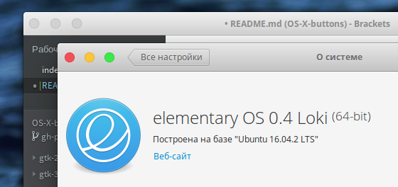
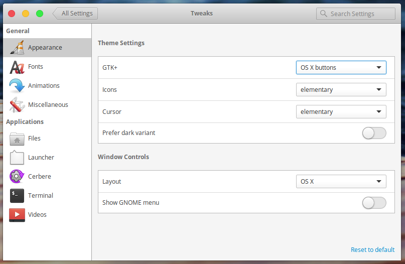

   

# OS X buttons for Elementary OS Loki
This is close, minimize and maximize buttons in OS X style for default theme Elementary OS Loki. 
Different states of buttons can see here - [click](https://gfycat.com/ifr/FlimsyNaughtyGerenuk?speed=2).
   
## Install guide
 - Use root and copy `OS-X-buttons` folder to this path `/usr/share/themes/`. Folder `OS-X-buttons` must be in `themes` directory.
 - Use elementary-tweaks to apply a theme. Go to `Appearance/GTK+` and select `OS-X-buttons` in dropdown list.

    

